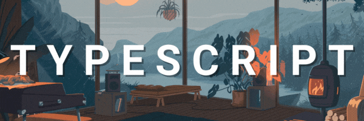
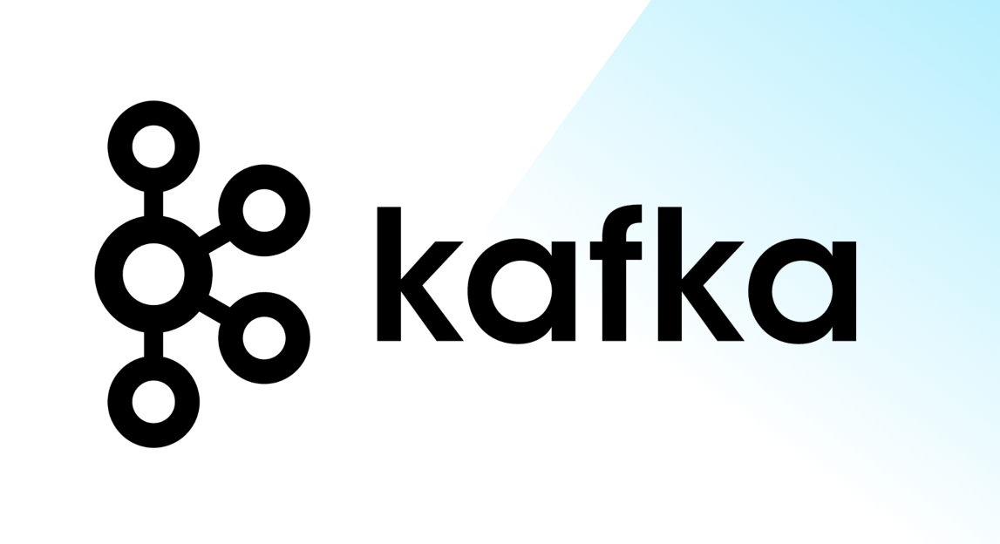
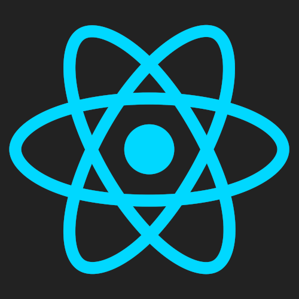
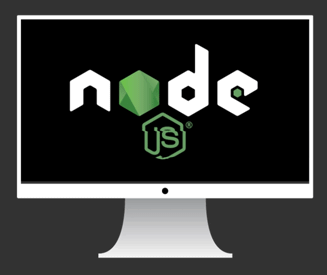
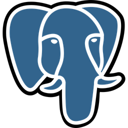
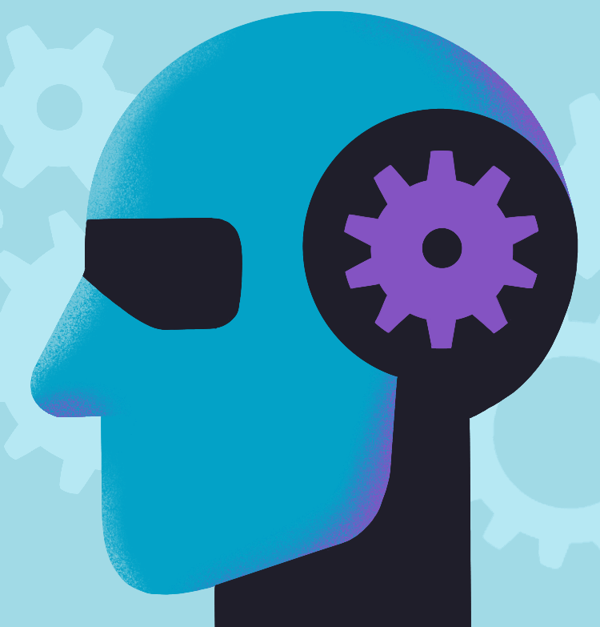

<!-- Banner -->

  

  <!-- Futuristic Neon Glitch Name -->
  

  <!-- Futuristic Neon Glitch Name -->
  

<h3 align="center">📬 Connect With Me</h3>

  
  &nbsp;&nbsp;&nbsp;&nbsp;
  
  &nbsp;&nbsp;&nbsp;&nbsp;
  
  &nbsp;&nbsp;&nbsp;&nbsp;
  

  

  <!-- Futuristic Neon Divider -->
  

## 🌟 About Me  

💡 *A self-believer who loves turning **dreams into reality*** ✨  

---

🎓 **4th Year | 7th Semester | Tech Enthusiast**  
🤝 **AI Intern** @ *Microsoft & SAP (TechSaksham Program)*  
🐍 **Python Developer Intern** @ *Alphawizz Technologies*  
🎶 **Flute Lover** 🎵  
📢 **Social Media Manager** @ *Google Developer Group (GDG) – PIEMR*  
👨‍💻 **Core Team Member** @ *ACM Chapter, PIEMR*  

### ⚡ Tech Stack & Skills  

  <!-- Animated Skills Icons with gaps -->
  
  
  
  
  
  
  
  
  
  
  
  
  
  
  
  
  

  

  

<h3 align="center">My Skillset</h3>
<table align="center">
  <tr>
    <td align="center"><strong>Python</strong></td>
    <td></td>
    <td align="center"><strong>Django</strong></td>
    <td></td>
  </tr>
  <tr>
    <td align="center"><strong>Flask</strong></td>
    <td></td>
    <td align="center"><strong>Machine Learning</strong></td>
    <td></td>
  </tr>
  <tr>
    <td align="center"><strong>JavaScript</strong></td>
    <td></td>
    <td align="center"><strong>React</strong></td>
    <td></td>
  </tr>
  <tr>
    <td align="center"><strong>Node.js</strong></td>
    <td></td>
    <td align="center"><strong>MongoDB</strong></td>
    <td></td>
  </tr>
   <tr>
    <td align="center"><strong>PostgreSQL</strong></td>
    <td></td>
    <td></td>
    <td></td>
  </tr>
</table>

## 🚀 Featured Projects

### **AI Interview Taker – Job Verse**
*An AI-powered platform to conduct, evaluate, and score interviews in real time.*

  
  
  

[💻 Code](#)

### **Customer Churn Prediction**
*Utilizes an Artificial Neural Network (ANN) with TensorFlow/Keras to predict customer churn, involving detailed data preprocessing and feature scaling.*

  
  
  

[💻 Code](#) | [🔗 LinkedIn Post](#)

### **Animal Image Classification**
*A computer vision model built with Python and OpenCV to analyze and classify images of different animals.*

  
  

[💻 Code](#)

### **AI-powered Resume Screening & Ranking**
*Scores and ranks resumes based on job description relevance using ML algorithms.*

  
  
  

[🔗 Live Demo](https://gautamsutar-resume-ranking-system-app-liqyh2.streamlit.app/) | [💻 Code](#)

## 🎯 Experience

* **Python Developer Intern**, *Alphawizz Technologies* — Ongoing
  Building backend modules and APIs using Python and Flask.
* **AI Intern**, *Microsoft & SAP (TechSaksham)* — Feb 2025 – Mar 2025
  Developed ML-based solutions using Python, Flask, and Streamlit.

  

## 📜 Achievements & Certifications

| Type        | Title & Details                                                                                               | Credential                                                                                                                                                             |
| :---------- | :------------------------------------------------------------------------------------------------------------ | :--------------------------------------------------------------------------------------------------------------------------------------------------------------------- |
| 📄 **Publication**  | **TravelMitra - Enhancing Regional Tourism in Indore**   *IJEASM, Jan 2025*                                | -                                                                                                                                                                      |
| 💼 **Role**         | **Social Media Manager**   *Google Developer Group (GDG), PIEMR*                                             | -                                                                                                                                                                      |
| 🏆 **Challenge**    | **GDG on Campus Solution Challenge 2025**   *Powered by Hack2skill*                                         |  |
| 🎓 **Course**       | **Machine Learning A-Z™: AI, Python & R**   *Udemy*                                                         |    |
| 🎓 **Course**       | **React, NodeJS, Express & MongoDB - The MERN Fullstack Guide **   *Udemy*                                                      |    |
