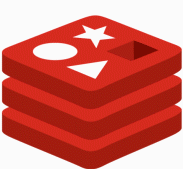
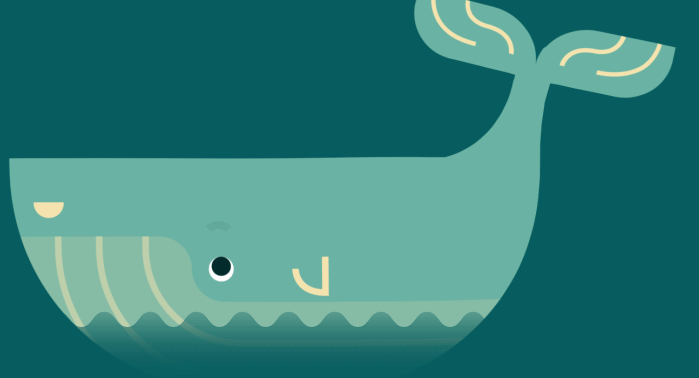

<!-- Banner -->

  

  <!-- Futuristic Neon Glitch Name -->
  

  <!-- Futuristic Neon Glitch Name -->
  

<h3 align="center">📬 Connect With Me</h3>

  
  &nbsp;&nbsp;&nbsp;&nbsp;
  
  &nbsp;&nbsp;&nbsp;&nbsp;
  
  &nbsp;&nbsp;&nbsp;&nbsp;
  

  

  <!-- Futuristic Neon Divider -->
  

## 🌟 About Me  

💡 *A self-believer who loves turning **dreams into reality*** ✨  

---

🎓 **4th Year | 7th Semester | Tech Enthusiast**  
🤝 **AI Intern** @ *Microsoft & SAP (TechSaksham Program)*  
🐍 **Python Developer Intern** @ *Alphawizz Technologies*  
🎶 **Flute Lover** 🎵 
📢 **Social Media Manager** @ *Google Developer Group (GDG) – PIEMR*  
👨‍💻 **Core Team Member** @ *ACM Chapter, PIEMR*  

---

### ⚡ Tech Stack & Skills

  
  
  
  
  
  

  
  
  

  
  
  

  
  
  

  
  

  

  

<h3 align="center">My Skillset</h3>
<table align="center">
  <tr>
    <td align="center"><strong>Python</strong></td>
    <td></td>
    <td align="center"><strong>Django</strong></td>
    <td></td>
  </tr>
  <tr>
    <td align="center"><strong>Flask</strong></td>
    <td></td>
    <td align="center"><strong>Machine Learning</strong></td>
    <td></td>
  </tr>
  <tr>
    <td align="center"><strong>JavaScript</strong></td>
    <td></td>
    <td align="center"><strong>React</strong></td>
    <td></td>
  </tr>
  <tr>
    <td align="center"><strong>Node.js</strong></td>
    <td></td>
    <td align="center"><strong>MongoDB</strong></td>
    <td></td>
  </tr>
   <tr>
    <td align="center"><strong>PostgreSQL</strong></td>
    <td></td>
    <td></td>
    <td></td>
  </tr>
</table>

## 🚀 Featured Projects

<!-- Project 1: LinkChat -->
<table bgcolor="#FFBF00" cellpadding="4"><tr><td>
<table bgcolor="#0D1117" width="100%">
  <tr>
    <td colspan="2">
      <h3>🔗 LinkChat</h3>
    </td>
  </tr>
  <tr>
    <td valign="top" width="70%">
      <b>A platform for real-time anonymous chat and peer-to-peer video calls using WebRTC.</b>
    </td>
    <td valign="top" width="30%">
      <strong>Tech Stack:</strong> 
      
      
      
      
    </td>
  </tr>
  <tr>
    <td colspan="2">
      
      
    </td>
  </tr>
</table>
</td></tr></table>

 

<!-- Project 2: AI Interview Taker -->
<table bgcolor="#FFBF00" cellpadding="4"><tr><td>
<table bgcolor="#0D1117" width="100%">
  <tr>
    <td colspan="2">
      <h3>🤖 AI Interview Taker</h3>
    </td>
  </tr>
  <tr>
    <td valign="top" width="70%">
      <b>An AI-powered platform to conduct, evaluate, and score interviews in real time.</b>
    </td>
    <td valign="top" width="30%">
      <strong>Tech Stack:</strong> 
      
      
      
    </td>
  </tr>
  <tr>
    <td colspan="2">
      
    </td>
  </tr>
</table>
</td></tr></table>

 

<!-- Project 3: Customer Churn Prediction -->
<table bgcolor="#FFBF00" cellpadding="4"><tr><td>
<table bgcolor="#0D1117" width="100%">
  <tr>
    <td colspan="2">
      <h3>📈 Customer Churn Prediction</h3>
    </td>
  </tr>
  <tr>
    <td valign="top" width="70%">
      <b>Utilizes an Artificial Neural Network (ANN) to predict customer churn.</b>
    </td>
    <td valign="top" width="30%">
      <strong>Tech Stack:</strong> 
      
      
      
    </td>
  </tr>
  <tr>
    <td colspan="2">
      
      
    </td>
  </tr>
</table>
</td></tr></table>

 

<!-- Project 4: Animal Image Classification -->
<table bgcolor="#FFBF00" cellpadding="4"><tr><td>
<table bgcolor="#0D1117" width="100%">
  <tr>
    <td colspan="2">
      <h3>🐾 Animal Image Classification</h3>
    </td>
  </tr>
  <tr>
    <td valign="top" width="70%">
      <b>A computer vision model to analyze and classify images of different animals.</b>
    </td>
    <td valign="top" width="30%">
      <strong>Tech Stack:</strong> 
      
      
    </td>
  </tr>
  <tr>
    <td colspan="2">
      
    </td>
  </tr>
</table>
</td></tr></table>

 

<!-- Project 5: AI Resume Screening -->
<table bgcolor="#FFBF00" cellpadding="4"><tr><td>
<table bgcolor="#0D1117" width="100%">
  <tr>
    <td colspan="2">
      <h3>📄 AI Resume Screening</h3>
    </td>
  </tr>
  <tr>
    <td valign="top" width="70%">
      <b>Scores and ranks resumes based on job description relevance using ML algorithms.</b>
    </td>
    <td valign="top" width="30%">
      <strong>Tech Stack:</strong> 
      
      
      
    </td>
  </tr>
  <tr>
    <td colspan="2">
      
      
    </td>
  </tr>
</table>
</td></tr></table>

 

<!-- Project 6: TravelMitra -->
<table bgcolor="#FFBF00" cellpadding="4"><tr><td>
<table bgcolor="#0D1117" width="100%">
  <tr>
    <td colspan="2">
      <h3>✈️ TravelMitra</h3>
    </td>
  </tr>
  <tr>
    <td valign="top" width="70%">
      <b>A tourism platform to find hidden gems, events, and book hotels by budget.</b>
    </td>
    <td valign="top" width="30%">
      <strong>Tech Stack:</strong> 
      
      
      
    </td>
  </tr>
  <tr>
    <td colspan="2">
      
      
    </td>
  </tr>
</table>
</td></tr></table>

## 🎯 Experience

* **Python Developer Intern**, *Alphawizz Technologies* — Ongoing
  Building backend modules and APIs using Python and Flask.
* **AI Intern**, *Microsoft & SAP (TechSaksham)* — Feb 2025 – Mar 2025
  Developed ML-based solutions using Python, Flask, and Streamlit.

  

## 📜 Achievements & Certifications

<table width="100%">
  <thead>
    <tr>
      <th width="15%">Type</th>
      <th width="55%">Title & Details</th>
      <th width="30%">Credential</th>
    </tr>
  </thead>
  <tbody>
    <tr>
      <td align="center">📄 <strong>Publication</strong></td>
      <td><strong>TravelMitra - Enhancing Regional Tourism in Indore</strong> <em>IJEASM, Jan 2025</em></td>
      <td align="center">-</td>
    </tr>
    <tr>
      <td align="center">💼 <strong>Role</strong></td>
      <td><strong>Social Media Manager</strong> <em>Google Developer Group (GDG), PIEMR</em></td>
      <td align="center">-</td>
    </tr>
    <tr>
      <td align="center">🏆 <strong>Challenge</strong></td>
      <td><strong>GDG on Campus Solution Challenge 2025</strong> <em>Powered by Hack2skill</em></td>
      <td align="center"></td>
    </tr>
    <tr>
      <td align="center">🎓 <strong>Course</strong></td>
      <td><strong>Machine Learning A-Z™: AI, Python & R</strong> <em>Udemy</em></td>
      <td align="center"></td>
    </tr>
    <tr>
      <td align="center">🎓 <strong>Course</strong></td>
      <td><strong>React, NodeJS, Express & MongoDB - The MERN Fullstack Guide</strong> <em>Udemy</em></td>
      <td align="center"></td>
    </tr>
  </tbody>
</table>

